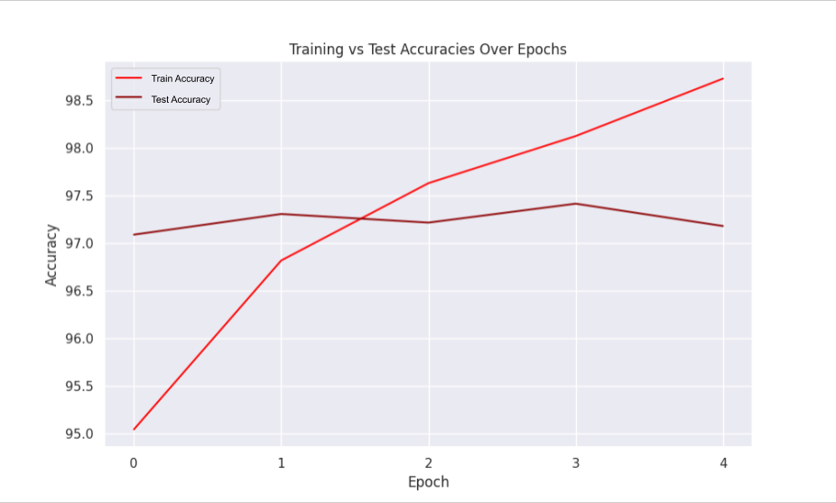

# Malaria Cell Classification:
The dataset I'll be training on was compiled by the NIH, it was derived and compiled from nine studies examining 714 patients. These studies compiled 27,558 images of cells that are either infected or uninfected with malaria. The images used for training were created through capturing images through an eyepiece of a microscope and then processing them through a series of [neural networks](https://ieeexplore.ieee.org/document/9244549). A few cells can be seen here:

   

I set out to train a network that examines the processed cells to determine whether or not they are infected with malaria. To begin, I examined the proportions of the cells present, and the proportions were exactly equal:

| Class    | Image Count|Proportion|
|----------|----------|----------|
| Infected | 13779    | 0.50     |
|Uninfected| 13779    |0.50      |

# Experiment 0: 
My first model had resnet34 architecture adjusted to compensate for just 2 classes. Additionally, the model came with pretrained weights, with the weight set orignating from ImageNet-1K. The training was remarkably fast with the accuracy improving to around 97% after just two epochs. However, I had my training set to 5 epochs and subsequent epochs led to possible overfitting, with training accuracy higher than my testing accuracy, and my training loss lower than testing loss.
### Accuracy Plot:

  

### Loss Plot:

  

### Future Directions:
* I noticed that the network trained quickly, in fact after 2 epochs the training accuracies and losses diverged. To compensate for this, I'll either reduce the model complexity of my current architecure and maintain the current epoch count or decrease epochs and maintain the current model complexity. 

# Experiment 1: 
The first model displayed fast training and quick diveregence. So for this experiment I decided to decrease epoch count while maintaining the current model complexity. This model showed impressive metrics, however, I think the metrics I'm using to evaluate my model could be expanded upon.
### Accuracy Plot:

  

### Loss Plot:

  

### Future Directions:
1) I want to explore other metrics. While loss and accuracy good measures to have in an arsenal of other measures, it shouldn't be the only measures used. I want to include confusion matrices, recall, precision, and specificity. I plan on adding these measures in future experiments.
